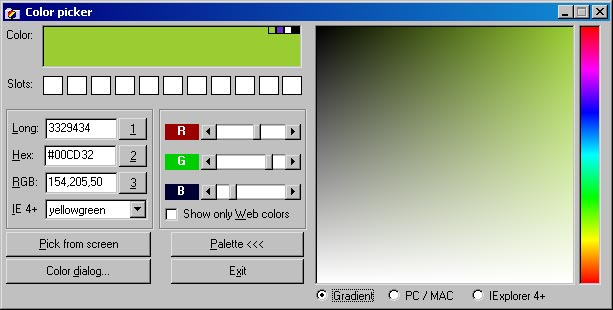



## Advanced VB Color Picker

### Description

Updated version (much faster, 16-bit color palette added.)

The Advanced Color Picker picks up colors from screen and from several built-in palettes: web-safe palette, Internet Explorer compatible palette and 2 Photoshop-like palettes. The color value can be obtained and converted between VB (long), HTML(hex) or RGB format. There are also a couple of other functions too. Vote, if you like it :-)
 
### More Info
 

             |
---                |---
**Submitted On**   |2001-06-14 09:16:24
**By**             |[Jordy](https://github.com/Planet-Source-Code/PSCIndex/blob/master/ByAuthor/jordy.md)
**Level**          |Advanced
**User Rating**    |5.0 (99 globes from 20 users)
**Compatibility**  |VB 5\.0, VB 6\.0
**Category**       |[Graphics](https://github.com/Planet-Source-Code/PSCIndex/blob/master/ByCategory/graphics__1-46.md)
**World**          |[Visual Basic](https://github.com/Planet-Source-Code/PSCIndex/blob/master/ByWorld/visual-basic.md)
**Archive File**   |[Advanced V211776152001\.zip](https://github.com/Planet-Source-Code/jordy-advanced-vb-color-picker__1-22480/archive/master.zip)

